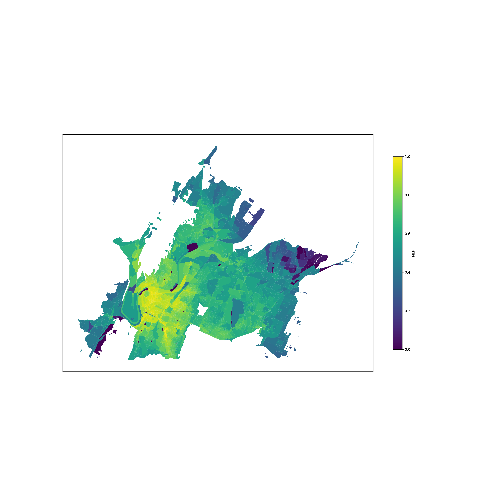
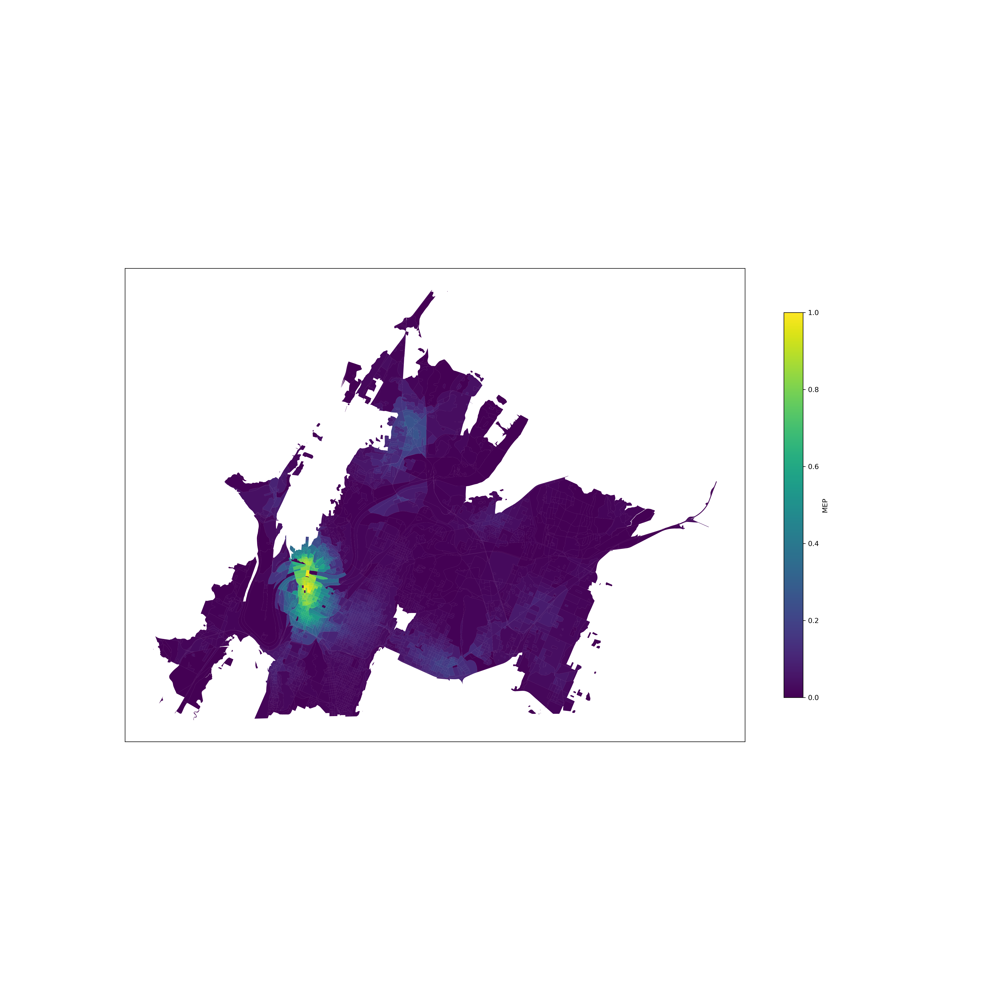
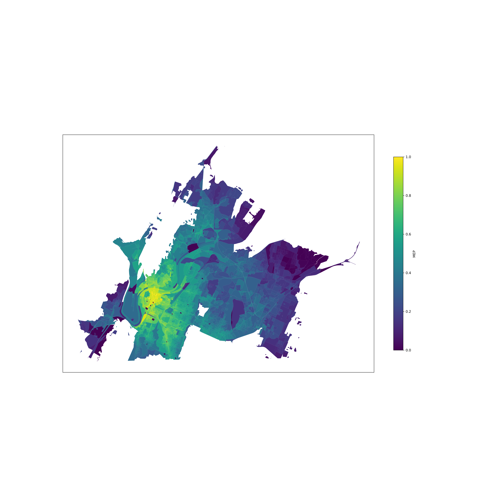

# Implementation of the MEP Metric

To evaluate the performance of a transportation system.

## Pre-requisites
1. Systems
    + Docker
    + Linux 

2. Python Packages
    + OSMnx 
    + GeoPandas
    + Requests

## Valhalla
Valhalla is an open-source routing engine. See the full documentation [here](https://valhalla.github.io/valhalla/). A demo server (accessed from [https://valhalla1.openstreetmap.de/isochrone](https://valhalla1.openstreetmap.de/isochrone)) is open to the public but the request rate limit is 1 call/user/sec. You need to depoly it in a running docker container in your local machine or server to bypass this limit. 

### Set up the docker container
Use the community image built by [gis-ops](https://github.com/gis-ops/docker-valhalla). Follow the instructions there to run the container. Be careful with the followings:

+ Download the lastest OSM data for the region you are interested in. Check [this](http://download.geofabrik.de/). 

+ If your container can be instantiated but exits immediately due to some erros, check this the Github issue [106](https://github.com/gis-ops/docker-valhalla/issues/106) and [107](https://github.com/gis-ops/docker-valhalla/issues/107) to resolve the problem. You might need to set the `server_threads` parameter explicitly in your container instantiation. Follow the instructions in the section called `Environment variables` in [gis-ops](https://github.com/gis-ops/docker-valhalla).

+ To enable some features related to transit in Valhalla
    + you need to download the GTFS data for the region you are interested in. Check the website of the local transit agency.
    + you need to specifically the section called `Build the image` in [gis-ops](https://github.com/gis-ops/docker-valhalla).

# Visualization of the Mobility Energy Performance (MEP) Score per Cencus Block
+ The MEP-enhanced map with a mobility-on-demand-only system

+ The MEP-enhanced map with a transit-only system

+ The MEP-enhanced map with a multi-modal system

